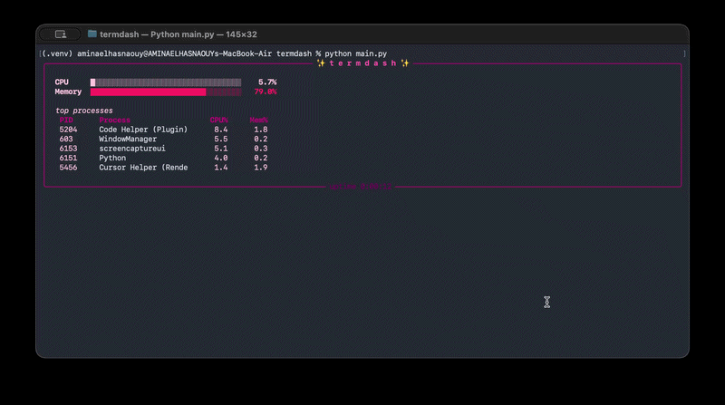

# ✨ termdash

A live terminal system monitor — CPU, memory, and top processes — rendered with reactive color-coded bars. Built from scratch on top of `psutil`, no external monitoring library doing the heavy lifting.



## Features

- **Live CPU & memory bars** that shift color based on load — soft pink when idle, hot pink under moderate load, red when something's spiking
- **Top 5 processes** by CPU usage, updated every second
- **Uptime tracker** for the session
- Fully self-contained, single-file Python script

## Install

```bash
git clone https://github.com/AMINA-ELHASNAOUY/Terminal_System_Dashboard.git
cd Terminal_System_Dashboard
python3 -m venv .venv
source .venv/bin/activate
pip install -r requirements.txt
```

## Usage

```bash
python main.py
```

Press `Ctrl+C` to exit.

## Tech stack

- Python 3
- [`rich`](https://github.com/Textualize/rich) — terminal rendering, live updates, styled text
- [`psutil`](https://github.com/giampaolo/psutil) — cross-platform system and process data

## Known limitations

- Bar width is fixed and doesn't yet adapt to terminal resize
- Process names longer than 20 characters are truncated without an ellipsis indicator

## Roadmap

- [ ] Responsive bar width on terminal resize
- [ ] Network I/O and disk usage panels
- [ ] Keyboard shortcut to kill a selected process
- [ ] Configurable refresh rate and color theme via CLI flags

## License

MIT — see [LICENSE](LICENSE).
